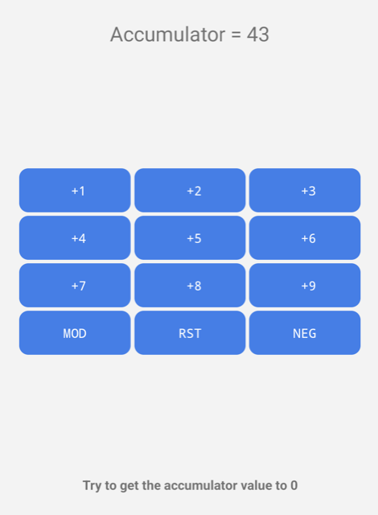
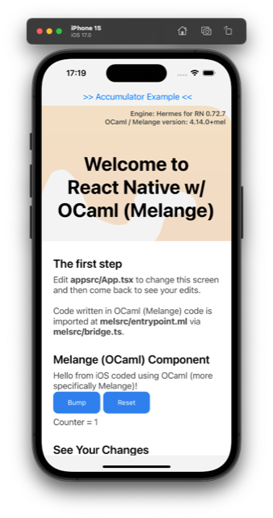
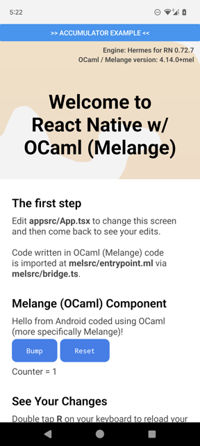
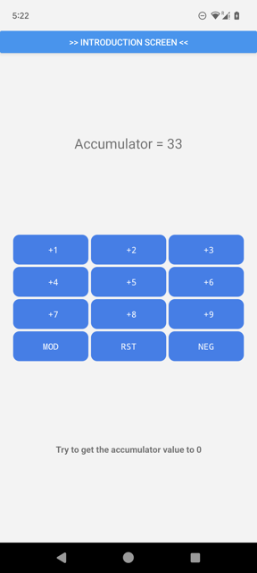

# kxc-melange-react-native-template

A template / sample project for OCaml (Melange) & React Native based monorepo
mobile application projects.

Be aware that this is a preliminary template / sample project and things are not guaranteed to work.

## The Teaser

(BTW: Android APK is available at the [GitHub release page (tag: v0-bc46w6a)](https://github.com/kxcdev/kxc-melange-react-native-template/releases/tag/v0-bc46w6a))

this rather silly game:



can be implemented with the following OCaml code (in `module Accumulator_example` of [`jsland/apps/mobile-app/melsrc/entrypoint.ml`](./jsland/apps/mobile-app/melsrc/entrypoint.ml) ):

```ocaml
  let[@react.component] body ?(initialAccumulatorValue = 3) () =
    let open Guikit in
    let accumulator, updateAccumulator =
      React.useState (constant initialAccumulatorValue) in
    let mode, updateMode = React.useState (constant (`plus : [ `plus | `minus ])) in
    let flip_mode = function `plus -> `minus | `minus -> `plus in
    ((text_str ~style:Style.accumulator
      & sprintf "Accumulator = %d" accumulator;
     ) :: (
       let mode_indicator, mode_effect = match mode with
         | `plus -> "+", (+)
         | `minus -> "-", Fn.flip (-)
       in
       let button' ?key ?onPress title =
         button title ?key ?onPress
         >! view ~style:Style.button in
       let row ?key elems = hview elems ?key ~style:Style.row in
       let row_of_action_buttons from : int -> React.element =
         (iotaf &&> row) &
           ((+) from) &>
             fun x ->
             sprintf " %s%d" mode_indicator x
             |> button' ~onPress:(fun () -> updateAccumulator (mode_effect x))
       in
       ([ row_of_action_buttons 1 3;
          row_of_action_buttons 4 3;
          row_of_action_buttons 7 3;
          row [
              button' "MOD" ~onPress:(fun () ->
                  updateMode flip_mode);
              button' "RST" ~onPress:(fun () ->
                  updateAccumulator (constant initialAccumulatorValue));
              button' "NEG" ~onPress:(fun () ->
                  updateAccumulator (( * ) (-1)));
            ];
        ] |> view) :: [
           let bingo = accumulator = 0 in
           text_str ~style:(Style.prompt ~bingo)
             (if bingo
              then "You did it! (tap RST to start over)"
              else "Try to get the accumulator value to 0");
     ])
     |> view ~style:Style.container)
```

you probably want to know about the following combinators which are not entirely standard (most of them are defined in [kxclib](https://kxc.dev/kxclib-ocaml)):
- `val (&) : ('a -> 'b) -> 'a -> 'b` - in the same spirit of Haskel's `$`, to reduce parentheses
- `val (&>) : ('x -> 'y) -> ('y -> 'z) -> ('x -> 'z)` - "backward" function composition
- `val (&&>) : ('x -> 'y -> 'z) -> ('z -> 'r) -> ('x -> 'y -> 'r)` - "backward" function composition for functions taking two arguments
- `val iotaf : (int -> 'a) -> int -> 'a list` - `iotaf f n` generates a list of `[0; ..; n-1]` then map it with `f`
- `let (>!) : 'a -> ('a list -> 'b) -> 'b = fun x f -> f [x]` - piping a value as a the only element to a function that expects a list as argument; analogy of `val (|>) : 'a -> ('a -> 'b) -> 'b`

can you make sense of it without first playing the game or looking at
the code dependencies (e.g. stuff that might have been in `Guikit`)?

## Get Started
```bash
## assume you have cloned the repository
## if submodule(s) haven't be initialized yet, you can do so with
git submodule update --init

## you should follow the Dev Setup Notes to have a complete dev setup

# to confirm Android SDK setup, you can use
ls "$ANDROID_HOME/platforms" # tested on: android-33-ext4
javac -version # tested on: javac 11.0.17
# to confirm Xcode setup, you can use
xcodebuild -showsdks # tested on: -sdk iphonesimulator17.0
# to confirm Node.js and Yarn setup, you can use
node --version # tested on: v18.17.1
yarn --version # tested on: 1.22.19
# to confirm OPAM setup, you can use
opam --version # tested on: 2.2.0~alpha3~dev
opam switch # tested on: compiler = ocaml-base-compiler.5.1.0,ocaml-options-vanilla.1
# to confirm OCaml version, you can use
ocamlc --version # tested on: 5.1.0
# to confirm CocoaPods version, you can use
pod --version # tested on: 1.14.2

## after dev setup, firstly do a warm-up build:
dune build
(cd jsland && yarn && yarn build)

## after the above succeed, you can start the dev building & packaging servers with
(cd jsland && yarn start-metro) &  # or run without the trailing '&' in another terminal
(cd jsland && yarn dev) &          # or run without the trailing '&' in another terminal

## you can now build, install, and start the Android app with
(cd jsland && yarn start-android)

## to build iOS app, you can install Podfile with
(cd jsland/apps/mobile-app/ios && pod install)
## you can also now build, install, and start the iOS app on a simulator with
(cd jsland && yarn start-ios-sim-iphone15)
## or, to run the iOS app on a real device: open the Xcode project and proceed in Xcode
## more instructions are available with
(cd jsland && yarn start-ios-device)
```

## Dev Setup Notes
### OCaml
* you will need OPAM and a ocaml.5.1.0 switch
  * see https://opam.ocaml.org/doc/Install.html for OPAM installation instructions
  * you can create a global opam.5.1.0 switch by running `opam switch create 5.1.0`; or
    * alternatively you can create a "local switch" (local to this project folder) by running
      `opam switch create . 5.1.0`
  * do remember to run `eval $(opam env --switch=5.1.0)` (note: the switch's name could differ)
    as instructed by OPAM after creating the switch
* once a OPAM switch is ready, you should be able to install all OCaml dependencies running `opam install . --deps-only --with-test`
  * there might be dependencies that is not listed and won't be installed with the command above.
    you can usually install the libraries needed using `opam install`, but please report if this happens.

### Node.js, Yarn, Android SDK, Xcode
* Node.js, Yarn, Android SDK, Xcode will be required to build / run this sample repo.
  please have them properly setup before proceeding

### IDE: VS Code
* recommended extensions to get:
  * OCaml Platform ([marketplace link](https://marketplace.visualstudio.com/items?itemName=ocamllabs.ocaml-platform))
  * ESLint ([marketplace link](https://marketplace.visualstudio.com/items?itemName=dbaeumer.vscode-eslint))
* you probably want the following in your `.vscode/settings.json`
    ```json
    {
      "eslint.workingDirectories": [
        {"mode": "auto"}
      ]
    }
    ```

## Most interesting files
* `<projroot>/jsland/apps/mobile-app/` - React Native application folder
  * [`appsrc/App.tsx`](./jsland/apps/mobile-app/appsrc/App.tsx)
  * `melsrc/` - OCaml (Melange) UI code
    * [`entrypoint.ml`](./jsland/apps/mobile-app/melsrc/entrypoint.ml)
    * [`bridge.ts`](./jsland/apps/mobile-app/melsrc/bridge.ts)
* `<projroot>/jsland/packages/mobile-app-ui/` - internal library
  * [`src/button.tsx`](./jsland/packages/mobile-app-ui/src/button.tsx)

## Screenshots

### iOS (Simulator - iPhone 15)


")
")

### Android (Device - Pixel 6)



## License
Most code is licensed under Apache License, Version 2.0 (the "License")
by the copyright holder(s) listed below.
You may obtain a copy of the License at http://www.apache.org/licenses/LICENSE-2.0.

Copyright 2023 Kotoi-Xie Consultancy, Inc.

Some code / material is licensed differently.
See [NOTICES](./NOTICES) for definitive information.
